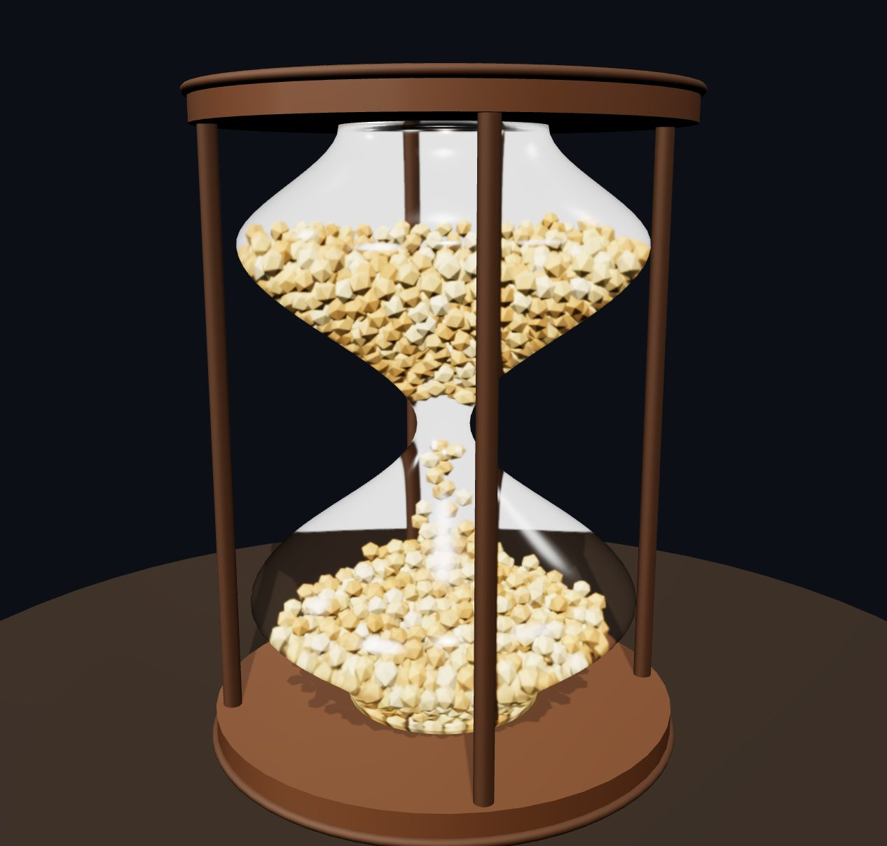

# ⌛ Hourglass — A Digital Twin Timer

[](LICENSE)
[](https://threejs.org)
[](https://rapier.rs)
[](#run-it)

A single-page 3D hourglass timer in which **every grain of sand is a real rigid body**,
simulated with the [Rapier](https://rapier.rs) physics engine (WASM) and rendered with
[three.js](https://threejs.org). Sand pours from the top bulb, streams through the neck,
and piles up in the bottom bulb under real gravity, friction and collision — and the last
grain lands as the countdown hits 0:00.

**▶ Live demo:** https://khanmjk.github.io/Hourglass_Fable5/



## Run it

Any static file server works (the libraries load from a CDN, so you need to be online
on first load):

```bash
cd Fable5_03July26_Hourglass
python3 -m http.server 8137
# then open http://localhost:8137
```

Most browsers will also run it straight from a double-click on `index.html`
(everything is ES modules over HTTPS; the physics WASM is embedded in the module).

## Using it

| Control | Action |
| --- | --- |
| **15 sec / 1 min / 5 min / 60 min** | pick a preset (custom minutes in the input field) |
| **Start / Pause** (or `Space`) | run or pause the timer |
| **⟲ Flip** (or `F`) | turn the hourglass over — sand tumbles, timer restarts |
| **Reset** (or `R`) | instantly restore all sand to the top |
| drag / scroll | orbit and zoom the camera |

Flipping is faithful to a real hourglass: flip it mid-run and the new run lasts only as
long as the sand that made it to the top (flip a 1-minute glass at 40s and you get a
~40-second timer back).

The amount of sand scales with the duration — a 1-minute glass holds 600 grains, a
5-minute+ glass holds 2,400 — so the neck always flows at a physically plausible rate
(~10 grains/second) instead of an impossible torrent.

## How it works

- **Rendering** — three.js `InstancedMesh` (one draw call for all grains), physical
  glass material with transmission, PMREM room environment, soft shadows.
- **Physics** — each grain is a Rapier dynamic rigid body with a ball collider. The
  glass interior is ~780 *thick convex boxes* arranged in rings that trace the lathe
  profile (zero-thickness trimeshes eject grains under pile pressure; solid walls
  can't). The world is built at 10× scale so grain radii sit near Rapier's solver
  tolerances, with gravity scaled to match — every fall time is identical to real time.
- **Perfect timing** — an invisible "gate" collider sits in the neck. Grains in the
  `HELD` collision group rest on it; releasing a grain moves it to a `FALLING` group
  that ignores the gate. A controller releases grains so that the count through the
  neck tracks `N · t / T` against the wall clock. Jams (real granular arching!) get a
  gentle "tap the glass" impulse, and any grain stuck longer than ~1.6s is invisibly
  teleported through the 1.3-unit-wide throat — the clock is always authoritative.
- **The flip** — the physics world never rotates. The *rendered* rig rotates by θ while
  physics gravity is set to `Rz(−θ)·(0,−g,0)` each frame — the exact equivalent frame
  of a fixed camera watching the glass turn. Sand genuinely tumbles during the turn.
- **Sleep management** — settled grains sleep (that's the performance budget). Rapier
  never wakes bodies when their support disappears, so a funnel-region wake runs while
  draining and a spatial-hash sweep wakes any grain left floating over a crater.
- **Background tabs** — if the tab is throttled, the wall clock stays authoritative:
  the controller teleports the backlog through the neck and the sand level is correct
  when you come back.

## Pinned libraries

| Library | Version | Why pinned |
| --- | --- | --- |
| three.js | 0.164.1 | last single-file `three.module.js` build with the classic `examples/jsm` addon layout |
| @dimforge/rapier3d-compat | 0.19.3 | `rapier.mjs` is genuine ESM with the WASM embedded — no bundler, no separate `.wasm` fetch |

Both load from jsDelivr via the import map at the top of `index.html`.

## Project layout

```
index.html        the entire application — markup, styles, simulation, UI
docs/             README assets
README.md         this file
LICENSE           MIT
```

## Known trade-offs

- The rigid-body budget caps at 2,400 grains, so a 60-minute glass drips
  ~0.7 grains/second — honest physics for grains of this size rather than a
  faked continuous stream.
- Rapier 0.19.3 logs a harmless `deprecated parameters` warning during WASM
  init (upstream issue, no effect).
- In heavily throttled/background tabs the sand reconciles via the invisible
  catch-up path; the countdown itself is always wall-clock exact.

## License

[MIT](LICENSE) © 2026 khanmjk

---

🤖 Built with [Claude Code](https://claude.com/claude-code)
